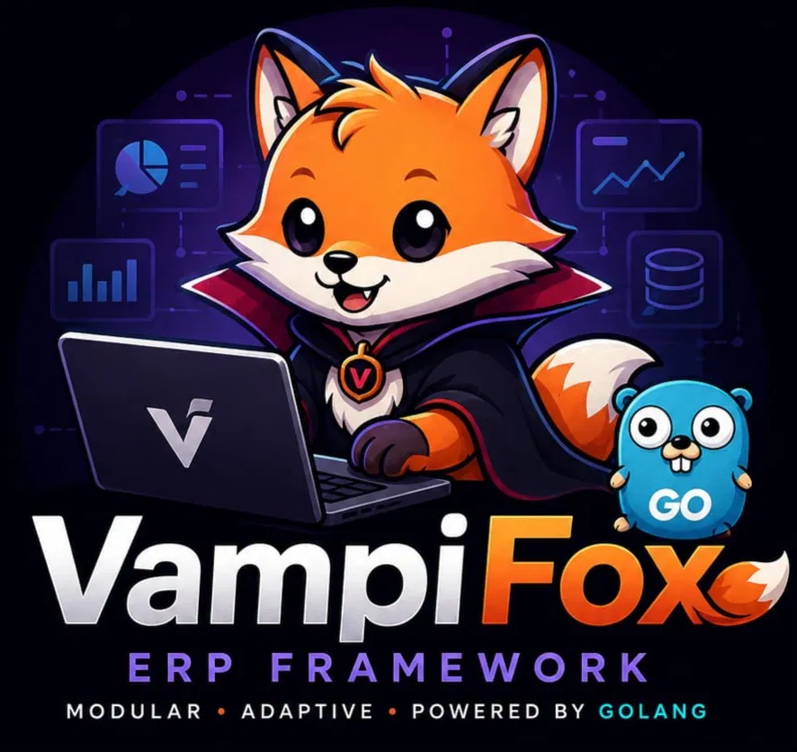

<div align="center">



# 🦊🧛 VampiFox ERP Framework

**"The Night Never Sleeps, The Fox Never Rests"**

### 💡 Key Characteristics

A modern ERP Framework built on **Golang** — fast, modular, and *multi-tenant*. Designed with a unique character:

* 🦊 **The Fox:** Clever, agile, and adaptive — the foundation for a nimble modular architecture.
* 🧛 **The Vampire:** Immortal, powerful, and data-hungry — the pillar for a *persistent* and *data-driven* system.

[](https://go.dev)
[](LICENSE)
[](https://github.com/vampifox)

</div>

---

## 🚀 Quick Start (Windows)

### 1. First Time — Run the Setup Wizard

```powershell
# Open PowerShell as Administrator
.\scripts\setup-windows.ps1
```

This script automatically installs: **Go**, **Git**, **Docker Desktop**, **VS Code**, and required extensions.

### 2. Check All Dependencies

```powershell
.\scripts\vfx.ps1 check
```

### 3. Start the Development Stack (PostgreSQL, Redis, MinIO, etc.)

```powershell
.\scripts\vfx.ps1 docker-up
```

### 4. Awaken VampiFox!

```powershell
.\scripts\vfx.ps1 awaken
```

---

## 📋 All Commands (`vfx.ps1`)

| Command | Function |
|---------|----------|
| `vfx.ps1 help` | Display all commands |
| `vfx.ps1 awaken` | Run server (dev mode) |
| `vfx.ps1 build` | Build `vampifox.exe` |
| `vfx.ps1 build-foxctl` | Build `foxctl.exe` (CLI tool) |
| `vfx.ps1 test` | Run all tests |
| `vfx.ps1 test-cover` | Test + open coverage report |
| `vfx.ps1 docker-up` | Start dev stack |
| `vfx.ps1 docker-down` | Stop dev stack |
| `vfx.ps1 migrate-up` | Run DB migrations |
| `vfx.ps1 migrate-down` | Rollback migrations |
| `vfx.ps1 migrate-create add_users` | Create new migration file |
| `vfx.ps1 check` | Check all dependencies |

> **Tip:** You can also use `vfx.bat` from regular CMD — same result.

---

## 🏗️ Architecture

```
vampifox/
├── cmd/
│   ├── vampifox/        # Main server entry point
│   └── foxctl/          # CLI tool (scaffold, migrate, etc.)
│
├── internal/
│   ├── den/             # 🏠 Dependency injection & lifecycle
│   ├── fangs/           # 🦷 Database layer (PostgreSQL/GORM)
│   ├── shadow/          # 👤 Cache layer (Redis)
│   ├── core/
│   │   ├── tenant/      # Multi-tenancy engine
│   │   ├── auth/        # JWT Sanctum (authentication)
│   │   ├── user/        # User management
│   │   ├── rbac/        # Role-based access control
│   │   └── audit/       # Audit trail
│   ├── modules/
│   │   ├── accounting/  # Accounting & finance
│   │   ├── inventory/   # Stock management
│   │   ├── purchasing/  # Purchasing
│   │   ├── sales/       # Sales
│   │   ├── hrm/         # HR & payroll
│   │   ├── crm/         # Customer management
│   │   ├── project/     # Project management
│   │   └── assets/      # Fixed assets
│   └── api/
│       ├── rest/v1/     # REST API
│       ├── graphql/     # GraphQL API
│       ├── webhook/     # Webhook handler
│       └── middleware/  # Bloodgate (auth), Covenant (rbac), etc.
│
├── pkg/
│   ├── foxutil/         # Common utilities
│   ├── bloodtype/       # Shared type definitions
│   ├── nightvision/     # Logging & observability
│   └── moonphase/       # Scheduler
│
├── deploy/
│   ├── docker/          # Dockerfile + docker-compose
│   ├── k8s/             # Kubernetes manifests
│   └── helm/            # Helm charts
│
├── migrations/          # SQL migration files
├── configs/             # YAML configuration
├── scripts/             # vfx.ps1, vfx.bat, setup-windows.ps1
└── .vscode/             # VS Code settings & launch config
```

---

## 🧛 VampiFox Glossary

| Term | Technical Meaning |
|------|-------------------|
| **Den** | DI Container & lifecycle manager |
| **Fangs** | Database connection (PostgreSQL) |
| **Shadow** | Cache layer (Redis) |
| **Sanctum** | JWT auth manager |
| **Bloodgate** | Auth middleware |
| **Covenant** | RBAC middleware |
| **Overlord** | Role: tenant owner |
| **Elder Vampire** | Role: admin |
| **Daywalker** | Role: manager |
| **Familiar** | Role: staff |
| **Spectre** | Role: auditor (read-only) |
| **Awaken** | Start server |
| **Slumber** | Graceful shutdown |
| **Moonphase** | Job scheduler |

---

## 🛠️ Tech Stack

| Layer | Technology |
|-------|------------|
| Language | **Go 1.23+** |
| Web Framework | **Gin** |
| ORM | **GORM** + PostgreSQL |
| Cache | **Redis** |
| Queue | **NATS JetStream** |
| Storage | **MinIO** (S3-compatible) |
| Auth | **JWT** (golang-jwt) |
| Config | **Viper** |
| Logging | **Zap** |
| GraphQL | **gqlgen** |
| Scheduler | **robfig/cron** |
| Container | **Docker** + **Docker Compose** |

---

## 📄 License

MIT License — free to use, modify, and distribute.

---

<div align="center">
Made with 🧛🦊 by VampiFox Team
</div>
